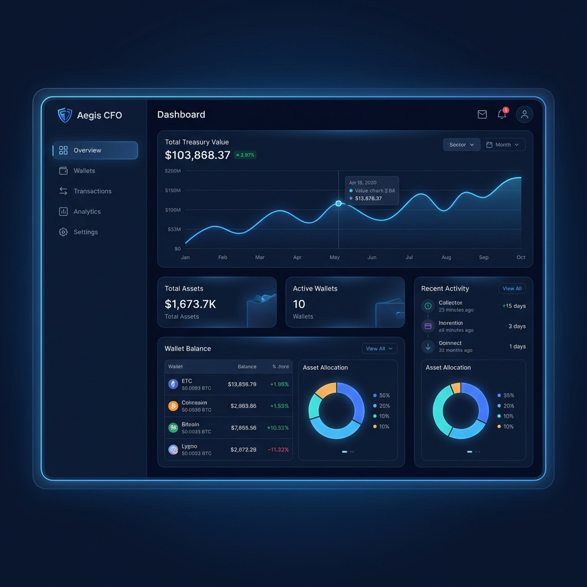
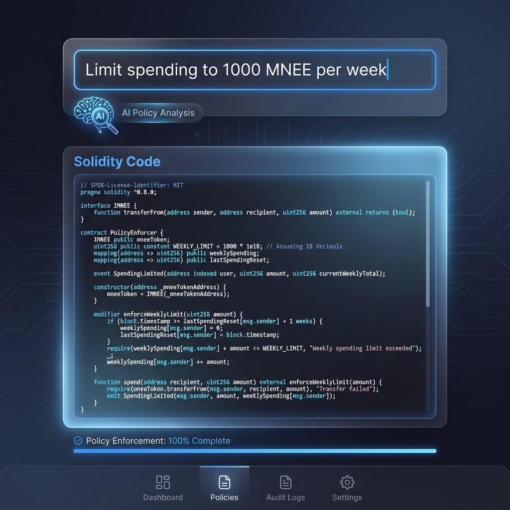

# Aegis Prime: The Autonomous Financial Guardian

**Aegis Prime** is an AI-powered financial operating system for crypto organizations. It moves beyond simple "multisig" wallets by acting as an intelligent, proactive CFO that manages payroll, analyzes runway, and enforces security policies in real-time.



## 🚀 Key Features

### 🧠 AI-Powered Financial Intelligence
*   **Natural Language Policies**: "Allow monthly payroll up to 50,000 MNEE" — parsed and enforced by the **AegisGuard** smart contract.
*   **Runway Forecasting**: Real-time calculation of financial survival based on live burn rates and treasury balance.
*   **Shadow Spend Detection**: AI analysis of transaction history to identify and flag unlabelled recurring drains.



### 🛡️ Smart Vault Architecture
*   **AegisGuard Contract**: A custom Solidity smart contract that holds funds and enforces AI-defined rules on-chain.
*   **Allowance-Based Delegation**: The AI acts as a "Smart Delegate," executing approved recurring payments (like payroll) within strict, user-defined limits.
*   **MNEE Token Native**: Built from the ground up to manage and protect MNEE token treasuries.


### 📊 Institutional-Grade Dashboard
*   **Dual-Mode Interface**: Seamlessly switch between **Real Mode** (Live Mainnet/Sepolia data) and **Demo Mode** (High-fidelity simulation).
*   **Redesigned Payroll Agent**: Manage specific recurring payment rules (Daily, Weekly, Monthly) with automated execution and on-chain enforcement.
*   **Live Asset Tracking**: Real-time ETH price fetching and MNEE valuation for accurate treasury reporting.
*   **Live Threat Map**: Visualizes blocked attacks and authorized operations globally.

## 🛠️ Tech Stack

*   **Frontend**: Next.js 14, Tailwind CSS, Framer Motion, Recharts.
*   **Blockchain**: Hardhat, Ethers.js, Solidity (Sepolia Testnet & Mainnet support).
*   **AI**: Google Gemini 2.0 Flash (Policy Parsing & Risk Analysis).
*   **Backend**: Supabase (Real-time logs, entity management, & analytics).

## 📦 Project Structure

*   `frontend/`: The Next.js dashboard and API routes.
*   `contracts/`: The Solidity smart contracts and deployment scripts.

## ⚡ Quick Start

### Prerequisites
*   Node.js 18+
*   MetaMask Wallet
*   Gemini API Key
*   Supabase Project

### 1. Clone & Install
```bash
git clone https://github.com/AbhayXplor/aegis-prime.git
cd aegis-prime

# Install Frontend Dependencies
cd frontend
npm install

# Install Contract Dependencies
cd ../contracts
npm install
```

### 2. Environment Setup
Create a `.env.local` file in `frontend/`:
```env
NEXT_PUBLIC_GEMINI_API_KEY=your_gemini_key
NEXT_PUBLIC_SUPABASE_URL=your_supabase_url
NEXT_PUBLIC_SUPABASE_ANON_KEY=your_supabase_key
NEXT_PUBLIC_SEPOLIA_RPC_URL=https://ethereum-sepolia-rpc.publicnode.com
NEXT_PUBLIC_MAINNET_RPC=https://eth.llamarpc.com
NEXT_PUBLIC_MNEE_ADDRESS=0x...
NEXT_PUBLIC_AEGIS_GUARD_ADDRESS=0x...
```

### 3. Run Locally
```bash
cd frontend
npm run dev
```
Visit `http://localhost:3000`.

## 🛡️ Smart Contracts

The `AegisGuard` contract is deployed on Sepolia.
*   **AegisGuard**: `0xC534d9923eA8fFE1A1e117352c1dE6c61F31e095`
*   **MockMNEE**: `0x469470675401b92f1D7f1e83B4660FE51026746e`

## 📄 License
MIT
